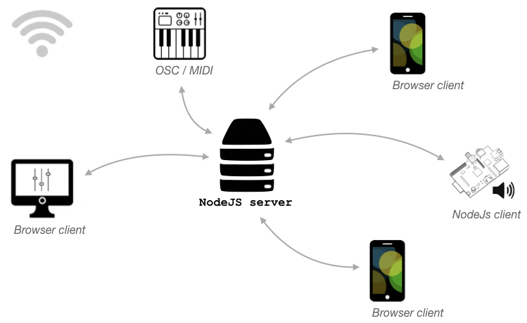

# `soundworks`


> `soundworks` is a framework dedicated a developping distributed and real-time multimedia application on the Web.

## Documentation

[http://collective-soundworks.github.io/soundworks/](http://collective-soundworks.github.io/soundworks/)

## Overview

`soundworks` follows a client / server architecture where the server is written using [Node.js](https://nodejs.org/) and clients can be either regular browser clients but also Node.js clients running for example on a Raspberry PI



## Installation

```
npm install @soundworks/core
```

## Installation

## Credits

*soundworks* has been initiated by @NorbertSchnell, @i-Robi, and @b-ma at the [ISMM](http://ismm.ircam.fr/) team at [Ircam - Centre Pompidou](http://www.ircam.fr/) in the framework of the [*CoSiMa*](http://cosima.ircam.fr/) research project supported by the [French National Research Agency (ANR)](http://www.agence-nationale-recherche.fr/en/). Futher developments has been supported in the framework of the [RAPID-MIX project](http://rapidmix.goldsmithsdigital.com/), funded by the European Union’s Horizon 2020 research and innovation programme.

## License

The *soundworks* framework is released under the [BSD 3-Clause](https://opensource.org/licenses/BSD-3-Clause) license.

